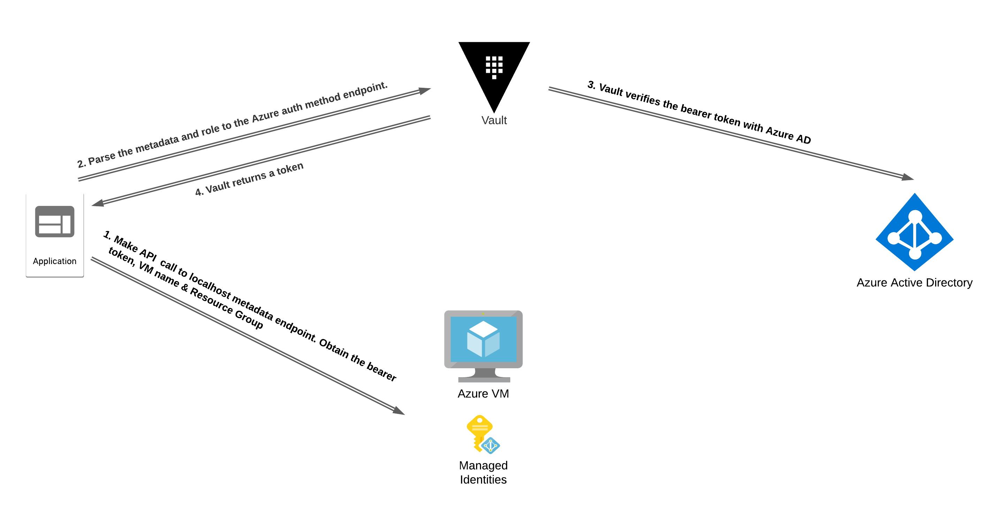

# Vault Authentication Azure Auth Method Demo Application

This application demonstrates how applications hosted on Azure VMs can use [managed identity](https://docs.microsoft.com/en-us/azure/active-directory/managed-identities-azure-resources/overview) to authenticate with HashiCorp Vault using the [Azure Auth Method](https://www.vaultproject.io/docs/auth/azure). For more information on using Azure Identity with HashiCorp Vault, checkout my [Integrating Azure AD Identity with HashiCorp Vault](https://www.hashicorp.com/blog/integrating-azure-ad-identity-hashicorp-vault-part-1-application-auth-oidc) blog series

Two environment variables need to be set for this demo application:

* `VAULT_ADDR` The address of your Vault instance
* `VAULT_ROLE` The name of the Vault role the application should use to authenticate

## DO NOT USE THIS IN PRODUCTION. IT IS FOR DEMONSTRATION PURPOSES ONLY.

## How this application works

The virtual machine will need a managed identity attached to it. This can either be `system-assigned` or `user-assigned`. This allows our application to make a local API call within the VM to obtain an oauth token.

Azure also has the Instance Metadata Service (IMDS) which allows our application to call a local endpoint on the VM to obtain useful metadata. In order to authenticate to Vault using the Azure auth method, the application need to obtain the `subscriptionID`, `resourceGroupName`, and `name` from the IMDS. These pieces of metadata in combination to the bearer token obtained using the managed identity, can then be verified by Vault checking with Azure that the information is valid. Once validated, Vault will return a Vault token to the application.



## How to use this application

1. Clone this repository to your Azure VM.
2. Set the required environment variables `VAULT_ADDR` and `VAULT_ROLE`.
3. Run `cd demo-app-vault-azure-auth` to change into the application directory.
4. Run `go run .`

You should see similar output to the following:

```text
Sucessfully authenticated to Vault.
Vault Token: s.YyP0P54uGMg5Cm67T8eMyax3 
```
